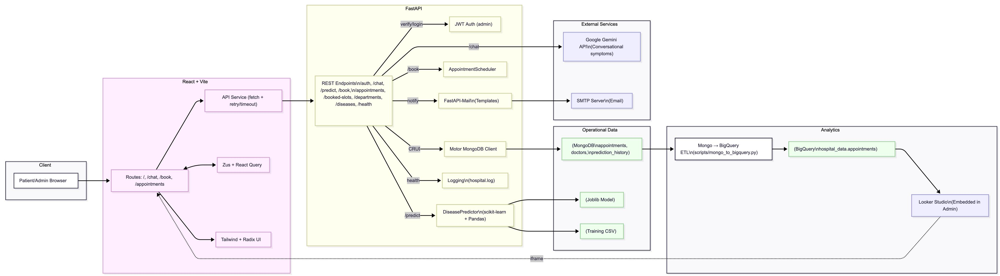
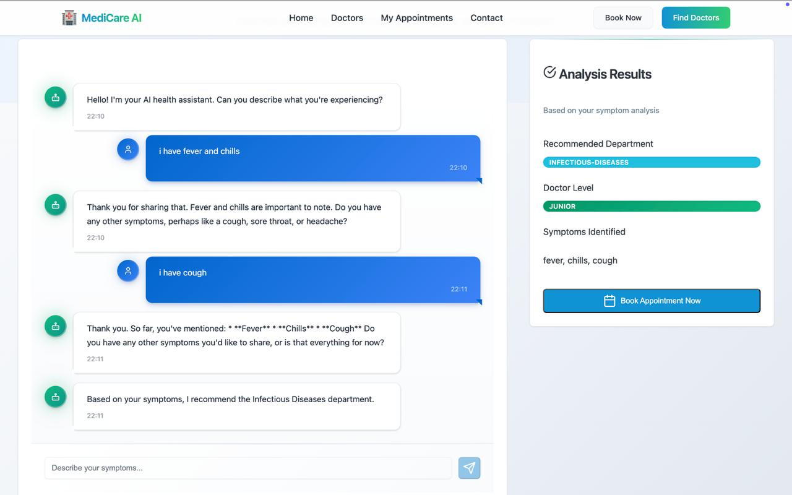
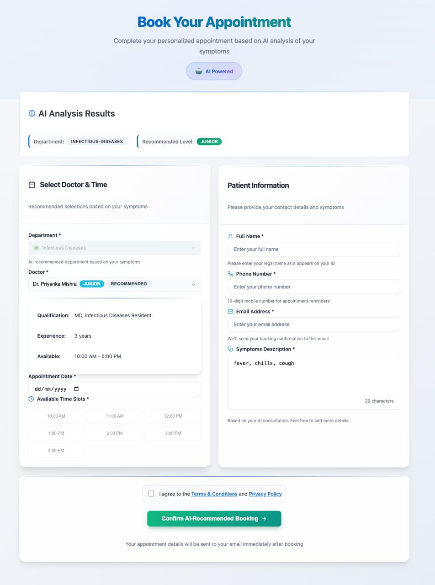
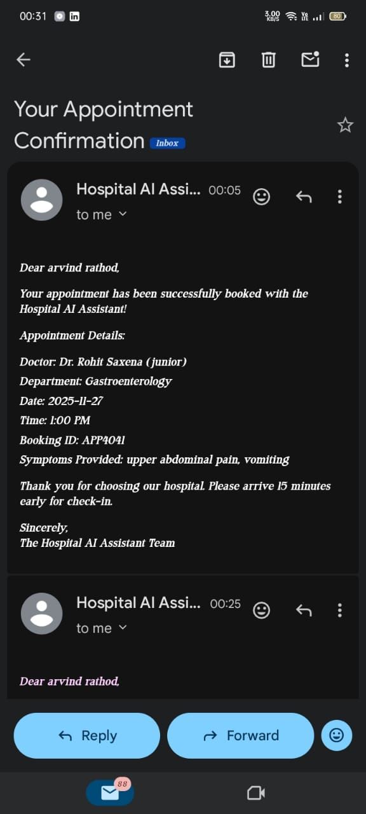
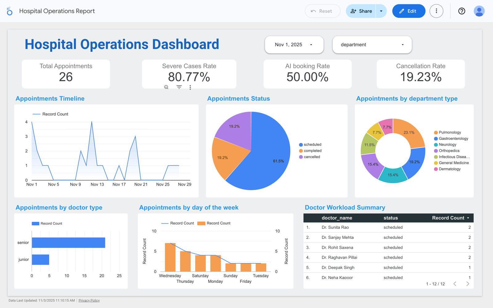
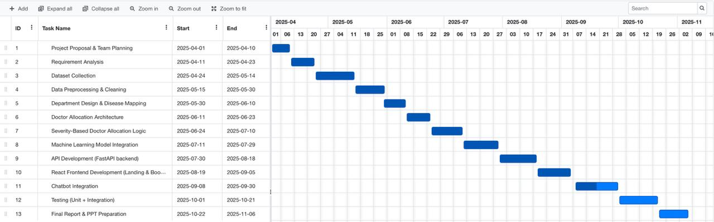

# Hospital Appointment Scheduling System

An AI-powered hospital appointment scheduling system with disease prediction and automatic doctor recommendations based on symptoms and severity analysis.

## 🏗️ System Architecture



```
Frontend (React + Vite)     ←→     Backend (FastAPI + Python)
├── Symptom Chat Interface           ├── Disease Prediction Model
├── AI Results Display               ├── Department Mapping
├── Doctor Selection                 ├── Appointment Scheduling
├── Booking Confirmation             └── API Endpoints
└── Responsive UI Components
```

## 🚀 Features

### Frontend Features
- **Interactive Symptom Chat**: AI-powered chat interface for symptom analysis
- **Smart Doctor Recommendations**: AI suggests appropriate doctors based on symptoms
- **Dual Booking Modes**: 
  - AI Mode: Automated recommendations
  - Manual Mode: User-selected doctors
- **Real-time Validation**: Form validation and error handling
- **Responsive Design**: Works on desktop and mobile devices
- **Appointment Management**: Complete booking flow with confirmation

### Backend Features
- **Disease Prediction**: Machine learning model for symptom analysis
- **Department Mapping**: Automatic routing to appropriate medical departments
- **Doctor Level Assessment**: Determines required doctor expertise level
- **RESTful API**: Complete API with OpenAPI documentation
- **CORS Support**: Configured for frontend integration
- **Error Handling**: Comprehensive error responses

## 📸 Screenshots

### Symptom Chat Interface

AI assistant collects symptoms conversationally and recommends a department + doctor seniority level in real time.

### AI-Recommended Booking Flow

Booking form pre-filled with AI recommendations, showing available doctors, qualifications, and time slots.

### Automated Appointment Confirmation

Automated email confirmation sent immediately after booking, with doctor, department, date, time, and booking ID.

### Hospital Operations Dashboard

Admin-facing Looker Studio dashboard tracking total appointments, severe case rate, AI booking adoption rate, cancellation rate, and department/doctor workload breakdowns.

## 🔧 Technology Stack

### Frontend
- **Framework**: React 18 with Vite
- **UI Library**: Radix UI components with Tailwind CSS
- **State Management**: Zustand
- **HTTP Client**: Fetch API
- **Routing**: React Router
- **Icons**: Lucide React

### Backend
- **Framework**: FastAPI (Python)
- **Machine Learning**: Scikit-learn, Pandas
- **Data Processing**: NumPy, Python-Levenshtein
- **Server**: Uvicorn ASGI server
- **API Documentation**: OpenAPI/Swagger

## 📦 Installation & Setup

### Automatic Setup (Recommended)
```bash
# Clone the repository and navigate to the project directory
cd hospital_system

# Run the automated setup script
./start.sh
```

### Manual Setup

#### Backend Setup
```bash
cd Backend

# Create virtual environment
python3 -m venv venv
source venv/bin/activate

# Install dependencies
pip install -r requirements.txt
```

#### Frontend Setup
```bash
cd Frontend

# Install dependencies
npm install

# Build for production (optional)
npm run build
```

## 🚀 Running the System

### Option 1: Automatic Startup
```bash
# Start both frontend and backend servers
./run_system.sh
```

### Option 2: Manual Startup

#### Start Backend Server
```bash
cd Backend
source venv/bin/activate
python -m uvicorn app.main:app --reload --port 8000
```

#### Start Frontend Server
```bash
cd Frontend
npm run dev
```

## 🌐 Access URLs

- **Frontend Application**: http://localhost:5173
- **Backend API**: http://localhost:8000
- **API Documentation**: http://localhost:8000/docs
- **OpenAPI Spec**: http://localhost:8000/redoc

## 🔄 API Integration

### Key API Endpoints

#### Disease Prediction
```http
POST /predict
Content-Type: application/json

{
  "symptoms": ["headache", "fever", "nausea"],
  "patient_id": "optional-id"
}
```

#### Book Appointment
```http
POST /book
Content-Type: application/json

{
  "department": "neurology",
  "doctor_level": "senior"
}
```

#### Get Departments
```http
GET /departments
```

### Frontend-Backend Communication

The frontend communicates with the backend through the API service layer (`src/services/api.js`), which handles:
- HTTP requests with error handling
- Response data transformation
- CORS configuration
- Request/response mapping

## 🧠 AI Workflow

1. **Symptom Input**: User describes symptoms in chat interface
2. **Symptom Parsing**: Frontend parses and cleans symptom text
3. **API Request**: Symptoms sent to backend prediction endpoint
4. **ML Analysis**: Backend processes symptoms through trained model
5. **Results**: System returns department, doctor level, and severity
6. **Booking**: User proceeds with AI-recommended appointment

## 📅 Project Timeline



Built over ~7 months, covering requirement analysis, dataset collection, ML model integration, backend/frontend development, chatbot integration, testing, and final documentation.

## 📁 Project Structure

```
hospital_system/
├── Frontend/                     # React application
│   ├── src/
│   │   ├── components/          # Reusable UI components
│   │   ├── pages/               # Page components
│   │   ├── services/            # API integration
│   │   ├── store/               # State management
│   │   └── data/                # Static data
│   ├── public/                  # Static assets
│   └── dist/                    # Built application
├── Backend/                     # FastAPI application
│   ├── app/
│   │   ├── main.py              # FastAPI app and routes
│   │   ├── predictor.py         # ML disease prediction
│   │   ├── scheduler.py         # Appointment scheduling
│   │   └── data/                # ML model and training data
│   └── venv/                    # Python virtual environment
├── start.sh                     # Setup script
├── run_system.sh               # Run script
└── README.md                   # Documentation
```

## 🔧 Configuration

### Backend Configuration
- **Port**: 8000 (configurable via uvicorn)
- **CORS Origins**: localhost:5173, localhost:3000
- **Model Path**: `app/data/rf_disease_model.joblib`
- **Training Data**: `app/data/Training_updated.csv`

### Frontend Configuration
- **API Base URL**: http://localhost:8000
- **Development Port**: 5173
- **Build Output**: `dist/` directory

## 🛠️ Development

### Adding New Features

#### Backend (New API Endpoint)
```python
@app.post("/new-endpoint")
async def new_feature(request: RequestModel):
    # Implementation
    return {"result": "data"}
```

#### Frontend (API Integration)
```javascript
// Add to src/services/api.js
export const hospitalAPI = {
  // ... existing endpoints
  newFeature: (data) => request('/new-endpoint', {
    method: 'POST',
    body: JSON.stringify(data),
  }),
};
```

### Testing the Integration

1. **Backend Health Check**: Visit http://localhost:8000/health
2. **API Documentation**: Check http://localhost:8000/docs
3. **Frontend Loading**: Ensure http://localhost:5173 loads properly
4. **Symptom Analysis**: Test chat interface with sample symptoms
5. **Booking Flow**: Complete an appointment booking

## 🐛 Troubleshooting

### Common Issues

#### CORS Errors
- Ensure backend CORS is configured for frontend URL
- Check that both servers are running on correct ports

#### API Connection Failed
- Verify backend server is running on port 8000
- Check network configuration and firewall settings

#### Module Not Found (Backend)
```bash
cd Backend
source venv/bin/activate
pip install -r requirements.txt
```

#### Dependencies Missing (Frontend)
```bash
cd Frontend
rm -rf node_modules package-lock.json
npm install
```

### Debug Mode
- **Backend**: Add `--log-level debug` to uvicorn command
- **Frontend**: Check browser console for error messages

## 🔒 Security Considerations

- Input validation on both frontend and backend
- Sanitized symptom parsing to prevent injection
- Secure handling of patient information
- CORS configured for specific origins only

## 🚀 Deployment

### Production Deployment
1. Build frontend: `npm run build`
2. Configure production API URL
3. Set up proper environment variables
4. Use production ASGI server (e.g., gunicorn)
5. Configure reverse proxy (nginx)

## 📝 License

This project is for educational purposes. Please ensure compliance with healthcare regulations in production use.

---

**Made with ❤️ for better healthcare accessibility through AI**

## 📚 Additional Documentation

For more detailed, task-focused docs, see the `docs/` folder:
- `docs/Overview.md` – Executive overview and architecture summary
- `docs/Setup.md` – End-to-end setup and environment files
- `docs/Environment.md` – All environment variables and ports
- `docs/Backend.md` – Backend modules, endpoints, data models
- `docs/Frontend.md` – Routes, components, state management
- `docs/API.md` – Full API reference with examples
- `docs/Deployment.md` – Production readiness and deployment options
- `docs/Troubleshooting.md` – Common issues and resolutions
- `docs/ClassDiagram.md` – System class diagrams (backend and frontend)
- `docs/Project_Report.md` – Comprehensive project report following academic guidelines

---
