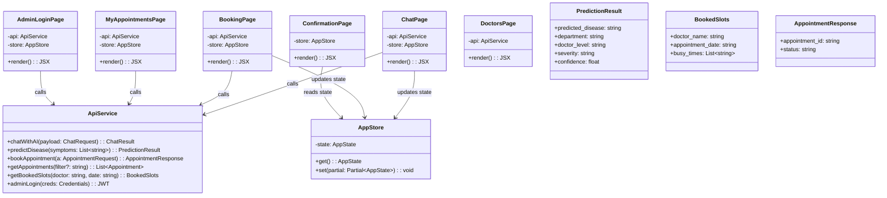

## System Class Diagrams

This document provides high-level UML-style class diagrams for both backend (FastAPI) and frontend (React) parts of the hospital appointment system. Diagrams are expressed in Mermaid for readability and ease of maintenance.

### Backend Class Diagram

```mermaid
classDiagram

%% Core Services
class API {
  +POST /chat
  +POST /predict
  +POST /book
  +GET /appointments
  +GET /appointments/{id}
  +PATCH /appointments/{id}
  +DELETE /appointments/{id}
  +GET /booked-slots
  +GET /departments
  +GET /diseases
  +GET /health
}

class DiseasePredictor {
  -model: RandomForestClassifier
  -symptomList: List~string~
  +predict(symptoms: List~string~): Prediction
  +mapDepartment(disease: string): string
  +assessSeverity(symptoms: List~string~): string
}

class AppointmentScheduler {
  -db: MongoDB
  +bookAppointment(a: Appointment): Appointment
  +getBookedSlots(doctor: string, date: date): List~time~
  +hasConflict(a: Appointment): bool
}

class AuthManager {
  +createAccessToken(payload: dict): string
  +verifyAdmin(token: string): Admin
}

class MongoDB {
  -client: MotorClient
  +getCollection(name: string): Collection
}

%% Data Models (Pydantic/MongoDB)
class AppointmentDB {
  +appointment_id: string
  +patient_name: string
  +patient_email: Email
  +patient_phone: string
  +doctor_name: string
  +doctor_level: string
  +department: string
  +appointment_date: date
  +appointment_time: time
  +symptoms: string
  +mode: string
  +status: string
  +created_at: datetime
  +updated_at: datetime
}

class DoctorDB {
  +name: string
  +department: string
  +level: string
  +email: Email
  +phone: string
  +specialization: string
  +available_days: List~string~
  +available_hours: Hours
}

class PredictionHistoryDB {
  +patient_id: string
  +symptoms: List~string~
  +predicted_disease: string
  +department: string
  +doctor_level: string
  +severity: string
  +confidence: float
  +timestamp: datetime
}

class Appointment {
  +appointment_id: string
  +patient_name: string
  +patient_email: Email
  +patient_phone: string
  +doctor_name: string
  +doctor_level: string
  +department: string
  +appointment_date: date
  +appointment_time: time
  +symptoms: string
  +mode: string
  +status: string
}

class Admin {
  +username: string
  +roles: List~string~
}

%% Relationships
API --> DiseasePredictor : uses
API --> AppointmentScheduler : uses
API --> AuthManager : uses
AppointmentScheduler --> MongoDB : persistence
AppointmentScheduler ..> AppointmentDB : reads/writes
DiseasePredictor ..> PredictionHistoryDB : writes
AuthManager --> MongoDB : reads
DoctorDB "1" --> "*" AppointmentDB : referenced
AppointmentDB "*" ..> PredictionHistoryDB : patient context
```

### Frontend Class Diagram



### Notes

- Controllers in FastAPI are represented by the `API` class for clarity, though endpoints are defined directly on the app in code.
- The `Appointment`, `PredictionResult`, and other data shapes are shown to clarify payloads exchanged between layers.
- This diagram is intentionally high-level to remain stable as implementation details evolve.

