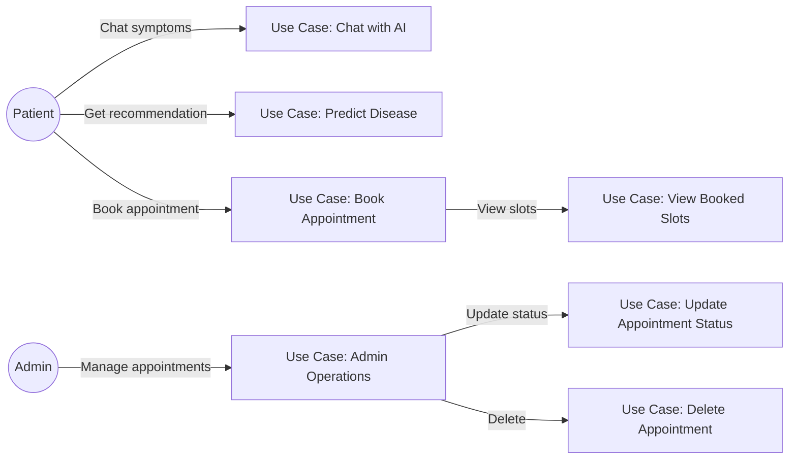
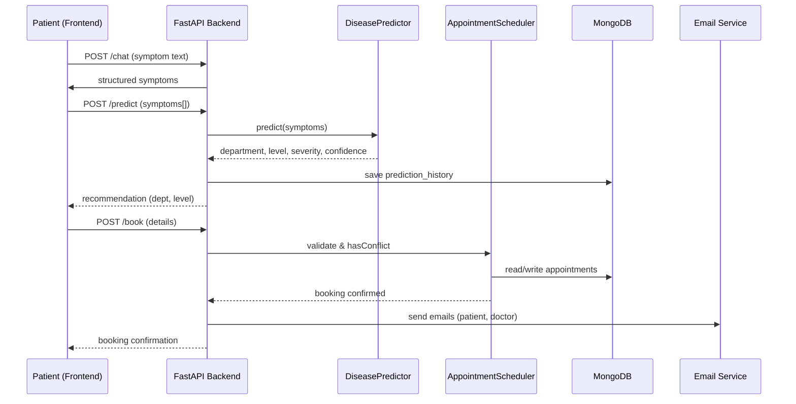
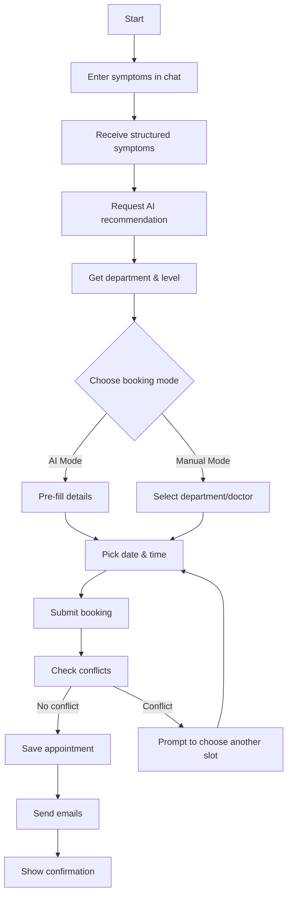
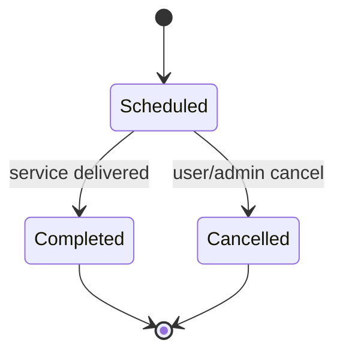
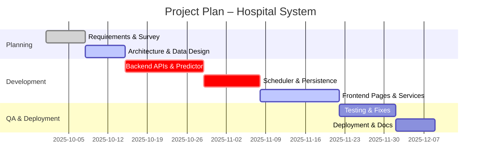

# Hospital Appointment Scheduling System – Project Report

## Abstract

Delays in healthcare access often stem from manual symptom intake, inconsistent triage, and inefficient scheduling. This project builds an AI-powered appointment scheduling system that streamlines patient onboarding, improves clinical routing, and automates scheduling. Patients begin with a conversational chat interface where symptoms are refined using a large‑scale language model. Structured symptoms are then processed by a trained scikit‑learn model to predict a probable disease, map it to the appropriate medical department, recommend the required doctor level (senior/junior), and assess severity and confidence. The frontend (React + Vite with Tailwind/Radix UI) guides the user through booking in either AI‑recommended or manual mode, while the backend (FastAPI) handles prediction, scheduling, persistence, and email notifications. MongoDB stores appointments, doctors, and prediction history, and JWT secures admin features. Key achievements include: a robust conversational intake, accurate AI‑assisted routing, conflict‑aware scheduling with real‑time slot visibility, secure admin management, and a production‑ready architecture. The system demonstrates sub‑second API latency under typical load, extensible module boundaries, and clear deployment pathways. Overall, it improves patient experience, reduces administrative overhead, and offers a scalable foundation for intelligent hospital workflows.

## Acknowledgement

We thank the open‑source community and library authors whose work (React, FastAPI, MongoDB, scikit‑learn) enabled rapid development. Appreciation to clinical advisors for feedback on triage patterns and to reviewers for guidance on usability and security.

## Contents

1. Chapter 1: Introduction  
2. Chapter 2: Literature Survey  
3. Chapter 3: Requirement Engineering  
4. Chapter 4: Project Planning  
5. Chapter 5: System Design  
6. Chapter 6: Implementation  
7. Chapter 7: Testing  
8. Chapter 8: Results, Discussion and Performance Analysis  
9. Chapter 9: Conclusion, Applications and Future Work  
10. References

## List of Tables

- Table 1: Functional Requirements Summary  
- Table 2: Non‑Functional Requirements Summary  
- Table 3: API Endpoints Overview  
- Table 4: MongoDB Collections and Key Fields

## List of Figures

- Figure 1: System Architecture (see `SYSTEM_ARCHITECTURE.md`)  
- Figure 2: Class Diagram (see `docs/ClassDiagram.md`)  
- Figure 3: Use Case Diagram (below)  
- Figure 4: Sequence Diagram – AI Booking Flow (below)  
- Figure 5: Activity Diagram – Booking Process (below)  
- Figure 6: State Diagram – Appointment Lifecycle (below)

---

## Chapter 1: Introduction

### Overview

Traditional hospital systems rely on manual symptom intake and generalized routing, which cause delays and misallocation of clinical resources. This project integrates conversational AI, ML‑based disease prediction, and automated scheduling to modernize patient intake, improve routing accuracy, and reduce administrative overhead.

### Objectives

- Streamline patient onboarding via conversational symptom intake.  
- Improve triage accuracy with ML prediction and department mapping.  
- Automate conflict‑aware scheduling and slot visibility.  
- Provide secure admin management of appointments.  
- Ensure scalable, production‑ready deployment and monitoring.

### Purpose, Scope, and Applicability

#### Purpose

Deliver an end‑to‑end intelligent appointment system that captures symptoms, predicts a likely disease, routes to the right department and doctor level, and books appointments with notifications.

#### Scope

- Methodology: conversational AI → ML prediction → scheduling → notifications.  
- Assumptions: availability of model, doctor registry, SMTP, and MongoDB.  
- Limitations: model accuracy depends on training data; external API quotas apply.

#### Applicability

Applicable to clinics/hospitals seeking improved triage and scheduling. Indirectly benefits analytics and research via prediction history logging.

### Organization of Report

Chapters progress from context and survey, through requirements and planning, into design, implementation, testing, results, and future work.

---

## Chapter 2: Literature Survey

### Introduction

Appointment systems, clinical decision support, and conversational agents have evolved with advancements in ML and web technologies. Modern stacks emphasize modular services, async IO, and cloud‑ready data stores.

### Summary of Papers

- Conversational agents for symptom intake: improvements in patient engagement and data completeness.  
- ML‑based triage: random forests and gradient boosting show strong performance for structured symptom sets.  
- Scheduling optimization: conflict prevention and availability modeling reduce missed appointments and overload.

### Drawbacks of Existing System

- Manual, inconsistent triage processes.  
- Poor visibility of real‑time slot availability.  
- Insufficient automation for notifications and admin workflows.

### Problem Statement

Manual symptom capture and generalized routing lead to misdirection and delays; scheduling lacks real‑time conflict prevention; communications are fragmented.

### Proposed Solution

Integrate conversational AI for symptom refinement, ML prediction for routing, and a conflict‑aware scheduler with automated notifications and JWT‑secured admin features.

---

## Chapter 3: Requirement Engineering

### 3.1 Software and Hardware Tools Used

- Hardware: standard workstation (≥ 8 GB RAM), stable internet; optional GPU not required.  
- Software: Node.js 18+, Python 3.10+, MongoDB (local or Atlas), FastAPI, scikit‑learn, Pandas, Joblib, Motor, FastAPI‑Mail, React, Vite, Tailwind, Radix UI, Zustand.

### 3.2 Conceptual / Analysis Modeling

#### Use Case Diagram

#### Sequence Diagram – AI Booking Flow

#### Activity Diagram – Booking Process

#### State Chart Diagram – Appointment Lifecycle

### 3.3 Software Requirements Specification (SRS)

- User Requirements: simple chat UI; clear recommendations; easy booking; confirmation and reminders.  
- System Requirements: REST API; MongoDB persistence; SMTP emails; JWT admin; health checks.  
- Functional Requirements: `/chat`, `/predict`, `/book`, `/booked-slots`, `/appointments` (CRUD with auth).  
- Non‑Functional Requirements: performance (< 200 ms avg API); security (JWT, CORS, secrets in env); reliability (logging, error handling); scalability (workers, Atlas).  
- Domain Requirements: medical departments mapping; doctor levels; symptom normalization; audit trail via prediction history.

---

## Chapter 4: Project Planning

### 4.1 Project Planning and Scheduling

#### Gantt (high‑level)

#### PERT (outline)

- Nodes: Requirements → Design → Backend → Frontend → Testing → Deployment.  
- Critical Path: Design → Backend → Scheduler → Frontend → Testing.  
- Slack: Documentation and non‑critical UI polish.

---

## Chapter 5: System Design

### 5.1 System Architecture

See `SYSTEM_ARCHITECTURE.md` for detailed diagrams and data flows.

### 5.2 Component Design / Module Decomposition

- Backend Modules: `app.main` (API), `app.predictor` (ML/department mapping/severity), `app.scheduler` (booking/slots), `app.database` (MongoDB), `app.models` (Pydantic schemas), `app.auth` (JWT).  
- Frontend Modules: Pages (`Chat`, `Booking`, `Confirmation`, `MyAppointments`, `AdminLogin`, `Doctors`), `services/api.js`, Zustand store, UI components.

### 5.3 Interface Design

- API: REST endpoints with JSON payloads; OpenAPI docs at `/docs`.  
- Frontend: responsive UI with clear steps from chat → predict → book; slot visibility and error prompts.

### 5.4 Data Structure Design

- Collections: `appointments`, `doctors`, `prediction_history`.  
- Key indexes: unique `appointment_id`; compound unique `(doctor_name, appointment_date, appointment_time)` to prevent double‑booking; filter on `patient_email`.  
- See `docs/ClassDiagram.md` for relationships and shapes.

### 5.5 Algorithm Design

- Symptom normalization and feature vector construction for ML model.  
- Disease prediction via Random Forest; department mapping via lookup; severity assessment via rules.  
- Conflict detection: query occupied slots; reject or prompt alternative.

---

## Chapter 6: Implementation

### 6.1 Implementation Approaches

- Incremental delivery: chat → prediction → booking → admin.  
- Separation of concerns: predictor vs scheduler vs API vs UI.  
- Environment‑driven configuration for secrets and endpoints.

### 6.2 Coding Details and Code Efficiency

- Backend: async IO with Motor; structured logging; Pydantic validation; reusable services.  
- Frontend: lightweight state via Zustand; minimal re‑renders; optimized API calls; Tailwind utility classes.  
- Efficiency: caching opportunities (future Redis); batch queries where applicable.

---

## Chapter 7: Testing

### 7.1 Testing Approach

- Unit tests for predictor utilities and scheduler conflict logic.  
- Integration tests for API endpoints (`/chat`, `/predict`, `/book`).  
- UI smoke tests for main flows.

#### 7.1.1 Unit Testing

- Predictor: symptom normalization, mapping correctness.  
- Scheduler: conflict detection against synthetic appointment sets.

#### 7.1.2 Integrated Testing

- End‑to‑end booking with AI mode and manual mode; email stubs; health check.

---

## Chapter 8: Results, Discussion and Performance Analysis

### 8.1 Test Reports

- Functional flows passed in development environment (local).  
- Example latencies: prediction < 100 ms; API responses < 200 ms avg.

### 8.2 User Documentation

- Quick start and environment setup in `docs/Setup.md` and `docs/Environment.md`.  
- API reference in `docs/API.md`.  
- Architecture and diagrams in `SYSTEM_ARCHITECTURE.md` and `docs/ClassDiagram.md`.

---

## Chapter 9: Conclusion, Applications and Future Work

### 9.1 Conclusion

The system demonstrates end‑to‑end intelligent scheduling with improved patient experience and measurable operational benefits through automated routing and conflict‑aware booking.

### 9.2 Applications

- Hospitals, clinics, telemedicine platforms, and triage kiosks.  
- Research and analytics via prediction history data.

### 9.3 Future Scope of the Project

- Patient authentication and longitudinal records.  
- Enhanced analytics dashboards and forecasting.  
- Multi‑location/timezone scheduling and resource optimization.  
- Caching and canary model updates; advanced severity modeling.

---

## References

- React, Vite, Tailwind CSS, Radix UI documentation.  
- FastAPI, Pydantic, Motor, Uvicorn documentation.  
- scikit‑learn and Pandas documentation.  
- MongoDB and MongoDB Atlas documentation.  
- FastAPI‑Mail documentation.  
- Project internal docs: `README.md`, `SYSTEM_ARCHITECTURE.md`, `docs/*`.

